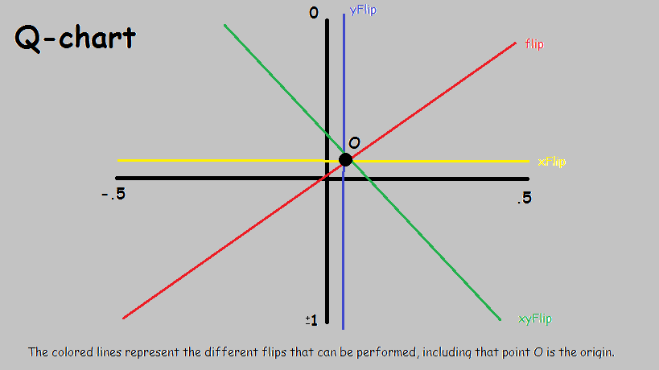

# Artificial Qubits

Hello, Welcome to my Quantum Experience with JavaScript.

I am using the p5.js library for display purposes (p5js.org for more info)

This program was created to mimic an actual Quantum computer. Keep in mind that this was not made exactly like real Quantum computer. So I had to make a lot of adjustments to create a similar replica. 

A Q-chart is a chart that specifical represents how my code is computed.

## Here is a visual representation of a single qubit on a 2D level.

## Updates needed:

* Proper Entanglement Handling
* Make the Qubit 3D, rather than 2D, and implement 3D flips
* Implement parallel programming (to improve entanglement results)
* Improve displaying of information (a chat-like interface)

## Information needed

* Find out the significance of the different dimensions of qubit, and how does that effect the probabilty.
* How would Entanglement be implemented in Object-Orient-Programming? Could it be implemented in Parallel Programming.
* How would you map a certain value to a qubit vector to predict it's value? 
* How does the qubit check the multiple values at one time? 

Thank you for looking at my project.

please email me for questions and suggestions - *admin@shadowkingbubba.com*
